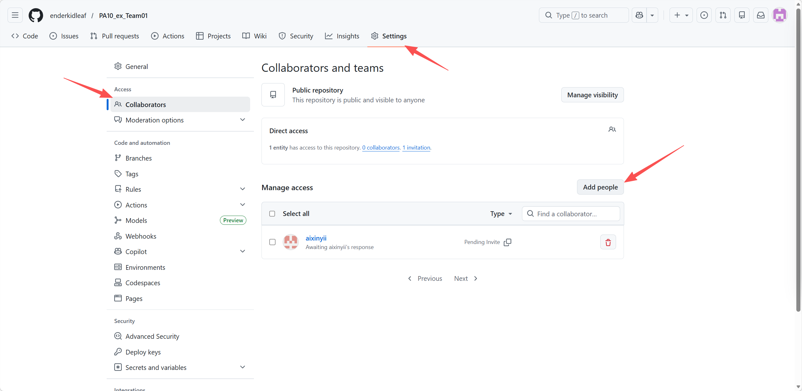
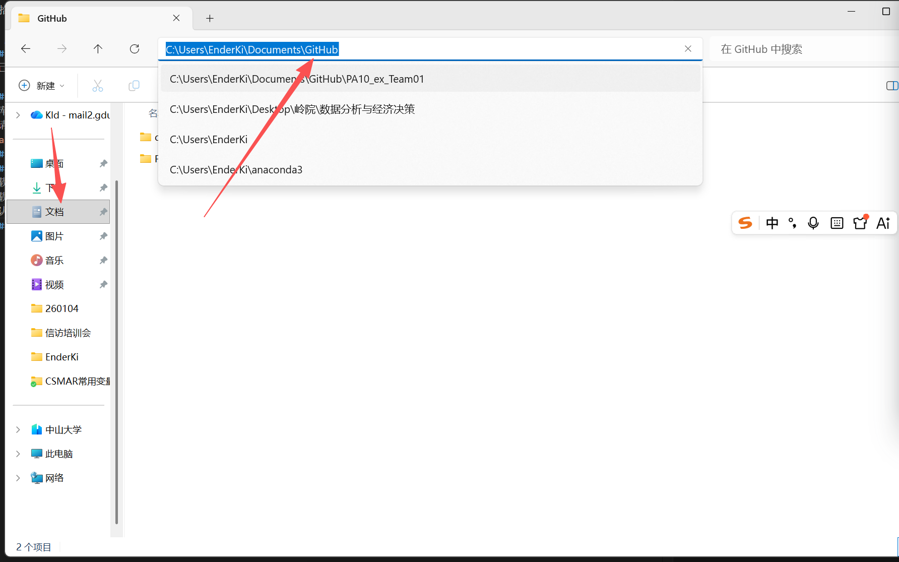
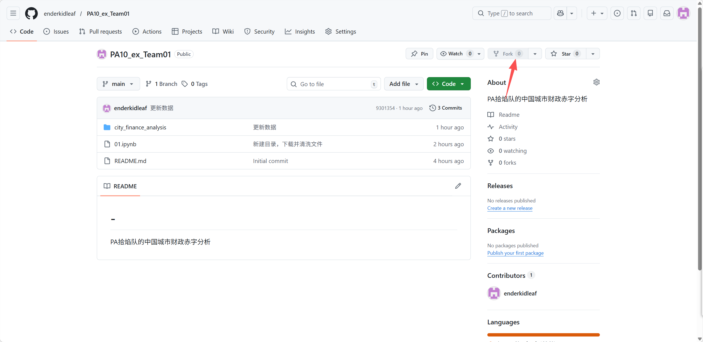
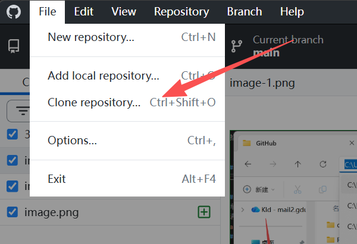
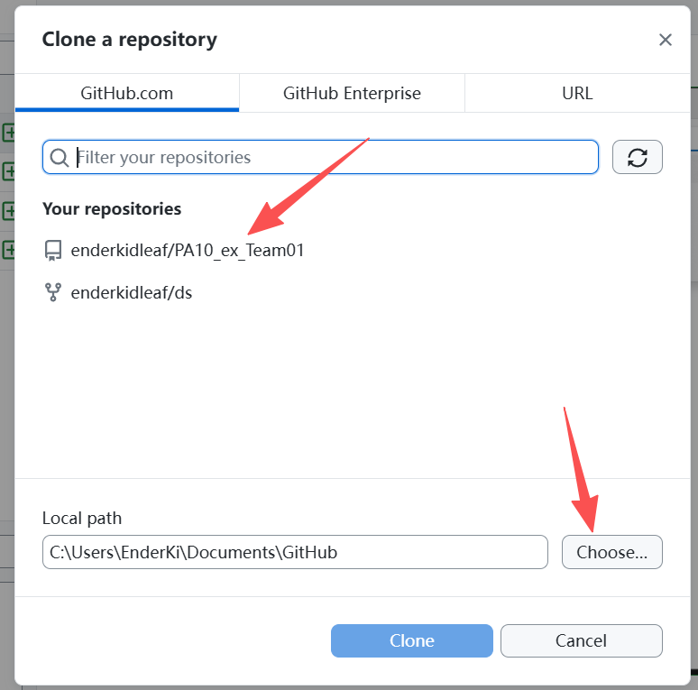
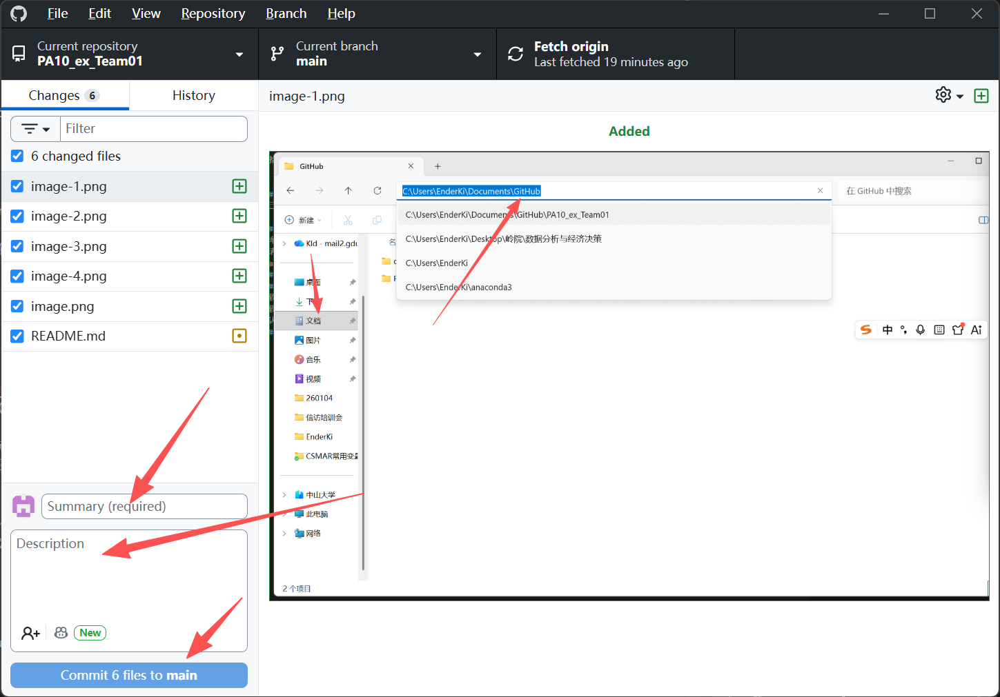
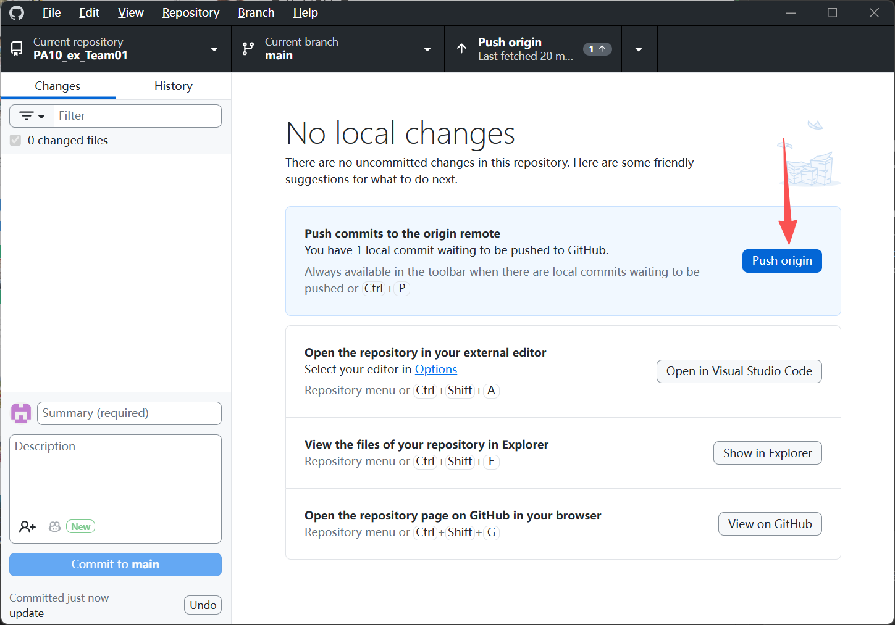

# PA10_ex_Team01

PA拾焰队的中国城市财政赤字分析

## github 使用简介
### 注册账号
自己 sign up 一下就好。
### 如何加入项目
项目建立人在该仓库页面上面点 setting，然后在左边点 collaborators，然后点 Add people，最后填写被邀请人的id，发送邀请即可。如下图所示：

### 如何在自己的电脑上编辑项目
#### 加入项目
找你的项目建立人把你加进 collaborators。
#### 下载安装紫猫 (Github Desktop)
- 下载 Github Desktop, 官方下载链接：https://desktop.github.com/download/
- 下载完了就打开安装包，安装即可。
- 默认安装的话，应该在文档里面的 Github 文件夹里。如下图所示：

#### 登录紫猫
- 打开紫猫，登录你的 Github 账号
#### folk 主仓库
- 进入主项目主页（比如本项目为：https://github.com/enderkidleaf/PA10_ex_Team01）
- 点folk，如图所示：
#### 在紫猫里克隆项目
- 在紫猫里点左上角的 file，然后点 clone repository，如图所示：
- 选择 folk 来的项目，然后选择目录，如图所示：
- 等下载完成
#### 编辑项目
- 打开 VS code（或其他项目管理软件）以下以 VS code 为例
- 点击左上角的文件，然后点击打开文件夹，选择你在 Clone 时选择的文件夹
- 进行编辑
#### 将编辑的内容上传到仓库
- 打开紫猫
- 在紫猫里点击 Fetch Origin
- 上一步完成后在左边的框内填写 summary 和 describe，其中 describe 不必要，没什么想说的也可以不填。
- 点 commit XX file to main 如图所示：
- 点 Pull origin（这一步很重要，别忘了）

Tips：
1. folk 是什么？ 我理解为把项目同步到自己的 Github 云仓库里。
2. clone 是什么？ 我理解为从云仓库里下载到本地并且关联起来，随时可以把自己本地做好的部分同步到云端（Push），也可以随时从云端同步到本地（Pull）。